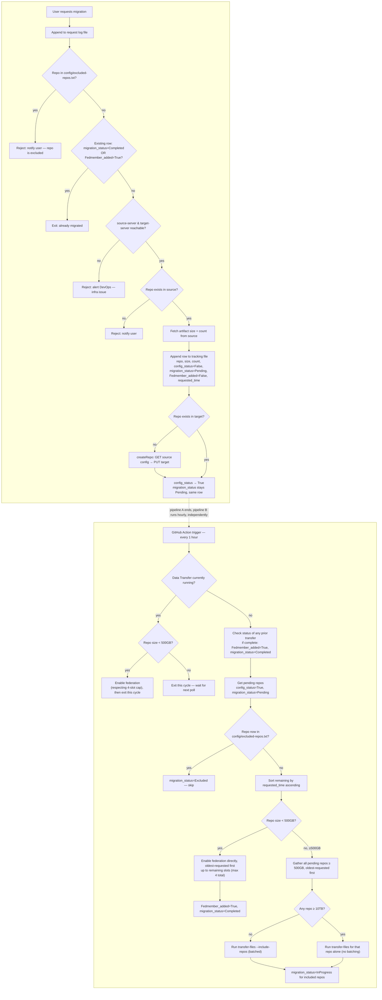
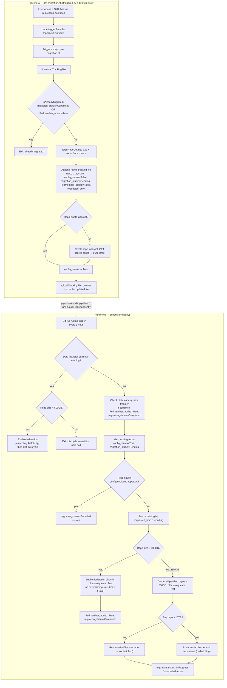

# JFrog migration self-service tool

Self-service tool to migrate Artifactory repositories from a source
instance to a target instance, using either JFrog Federation (small
repos) or Data Transfer (`jf rt transfer-files`, large repos),
implemented as shell scripts run by GitHub Actions. A per-request
pipeline logs and prepares each repo; an hourly scheduler picks up
prepared repos and runs the appropriate migration mechanism. State is
tracked in a single file committed back into this repo.

## Status

Design / early implementation. The scripts currently implement the
older single-pipeline version (connectivity check → repo check/create →
transfer). The Federation + Data Transfer design below is the agreed
direction — see `docs/design.md` for open decisions (size thresholds,
federation-cap counting, failure handling) and rationale.

## High-level flow

**Pipeline A — pre-migration (runs per request)**

1. **One-time, manual:** Data Transfer plugin installed on the source VM
   (not checked or managed by this tool — see
   [One-time setup: source instance](#one-time-setup-source-instance)
   below).
2. User requests a migration; the request is appended to a request log
   file.
3. **Exclusion check:** if the repo name appears in
   `config/excluded-repos.txt`, reject immediately and notify the user
   — no tracking row is created. See
   [Excluding repos from migration](#excluding-repos-from-migration)
   below.
4. **Early exit:** if a tracking row already exists for this repo with
   `migration_status = Completed` OR `Fedmember_added = True`, exit
   immediately — no connectivity check, no repo lookups. Already done.
5. Connectivity check: `jf rt ping` against `source-server` and
   `target-server`. If either is unreachable, reject and **alert
   DevOps** (infra issue, not something the requesting user can fix).
6. If the repo doesn't exist in source at all, reject and notify the
   user (this one's user-actionable).
7. Fetch artifact size + count from source, and append a row to a
   single tracking file: `repo, size, count, config_status=False,
   migration_status=Pending, Fedmember_added=False, requested_time`.
   `requested_time` is set once here and never changed — it's what
   Pipeline B uses to order pending repos.
8. Config-only transfer: if the repo doesn't exist in target, create it
   from source's config (`GET` source → `PUT` target). No data is moved
   in this step.
9. Flip `config_status` to `True` in that same row. `migration_status`
   and `Fedmember_added` stay untouched — Pipeline A never sets either
   of them again.

**Pipeline B — federation + data transfer scheduler (hourly)**

Two migration mechanisms, chosen by repo size: **Federation** (near
instant, capped at 4 concurrently enabled repos) for repos under 500GB,
and **Data Transfer** for repos at or above 500GB. A repo moved via Data
Transfer is added as a federation member once its transfer completes.

10. Runs on an hourly schedule (not triggered by Pipeline A). First
    check: **is a Data Transfer job currently running?**
11. **If running:** a pending repo under 500GB still gets federation
    enabled (respecting the 4-slot cap), then the cycle exits — no new
    Data Transfer is started while one is already in flight.
12. **If not running:** first check the status of any previously
    started transfer; if it completed, add that repo as a federation
    member (`Fedmember_added = True`, `migration_status = Completed`).
    Then get pending repos (`config_status = True, migration_status =
    Pending`), **re-check each against `config/excluded-repos.txt`**
    (a repo can be added to the exclusion list after it was already
    queued — this catches that), skip and mark any match
    `migration_status = Excluded`, then sort what's left by
    `requested_time` ascending — oldest request first within each size
    bucket below:
    - Under 500GB → enable federation directly, oldest-requested first,
      up to the remaining slots (max 4 total) → `Fedmember_added =
      True, migration_status = Completed`.
    - 500GB or more → gather all pending repos in that size class,
      oldest-requested first, and run `jf rt transfer-files
      --include-repos` as one batched job — **except** if any repo is
      10TB or larger, in which case it runs alone, unbatched. Rows
      included are set to `migration_status = InProgress`.

## Repo layout

```
.github/workflows/migrate.yml   workflow_dispatch trigger, orchestrates the steps below
.github/workflows/lint.yml      shellcheck on every script change
scripts/pre-migration.sh        Pipeline A: download tracking file, connectivity + repo existence checks, config-only repo creation, upload tracking file (was track-repo.sh / repo_manager.sh)
scripts/migrate.sh              preMigration wait check, runs transfer-files, polls progress, logs diff_notes
scripts/state.sh                init/update/read state/<job_id>.json, commits + pushes
scripts/lib/common.sh           logging, env config loader, shared by all scripts
config/environments.yaml        source/target server ids, URLs, thresholds (no secrets)
config/excluded-repos.txt       repo keys to skip on request, one per line, # for comments
state/                          committed per-job state files
docs/                           design notes, decisions, open questions
```

> **Not yet implemented in the scripts:** the request log file, the
> seven-column tracking file (`config_status`, `migration_status`,
> `Fedmember_added`, `requested_time`), the exclusion-list check, the
> early-exit check, the Federation-enable path, the hourly scheduler and
> its running/not-running branching, the `requested_time` sort, the
> `--include-repos` batching, and the start/completion team
> notifications. Currently `pre-migration.sh` and `migrate.sh` run the
> older single-pipeline version (connectivity → repo check/create →
> transfer, one repo per run, no Federation). This README documents the
> design we're building toward — see `docs/design.md` for what's tracked
> as open (the 500GB/10TB thresholds, whether a Data-Transfer-completed
> repo counts toward the 4-slot federation cap, and failure/retry
> handling for the scheduler, which isn't defined yet).

## Flow diagram



## Script-level flow: pre-migration.sh

The diagram above shows the business-logic decisions; this one shows
the actual steps `pre-migration.sh` (the script `track-repo.sh` is
being renamed to) runs on the self-hosted runner for Pipeline A, and
how it hands off into the same hourly Pipeline B shown above.



> **Note:** this view intentionally starts from `downloadTrackingFile`
> and doesn't repeat the connectivity check, the "repo missing in
> source" rejection, or the exclusion-list check already shown in the
> [flow diagram](#flow-diagram) above — those still apply, this is just
> a closer look at the tracking-file mechanics of the same pipeline.

## Requirements

- A self-hosted GitHub Actions runner (the migration VM itself) with
  `jf c add source-server ...` and `jf c add target-server ...` already
  configured manually — no tokens or `jf` server setup happens inside
  the workflow
- GitHub Actions with `contents: write` permission on this repo (needed
  to commit the tracking file / request log back)
- `jf` CLI, `jq` on the runner (already required for the manual `jf c
  add` step above)

## Excluding repos from migration

`config/excluded-repos.txt` lists repo keys that should never be
migrated — one exact repo key per line, blank lines and lines starting
with `#` are ignored (same idea as `.gitignore`, but exact-name
matching only; no glob patterns yet).

```
# staging repos we don't want moved
staging-npm-local
staging-docker-local
```

This is checked in two places:

- **Pipeline A**, before a tracking row is even created — a request
  for an excluded repo is rejected immediately and the user is
  notified. Nothing is written to the tracking file.
- **Pipeline B**, on every hourly run, against repos still `Pending` —
  this catches a repo that was queued *before* it was added to the
  exclusion list. A match is set to `migration_status = Excluded` and
  skipped, rather than left stuck at `Pending` forever with no way to
  tell it apart from one that's simply waiting its turn.

## One-time setup: source instance

Before any migration can run, the source Artifactory instance needs a
dedicated migration user, the JFrog CLI configured against it, and the
Data Transfer plugin installed. **This is a manual, one-time step per
source instance — it is not checked, run, or verified by this tool.**

### 1. Create a migration user

Create a user named `migrationuser` on **both** the source and target
JPD, then generate an access token for that user on each instance —
the CLI configuration in the next two steps authenticates with these
tokens rather than a username/password login.

### 2. Configure the JFrog CLI on the source instance

Run these commands directly on the source Artifactory host (this
assumes a containerized deployment with direct access to
`localhost:8082`):

```bash
cd /opt/jfrog/artifactory/var
mkdir tmp
cd tmp

# Download the CLI into this folder — safe to use here since it's inside the container
curl -fkL https://getcli.jfrog.io/v2-jf | sh

# Make it executable
chmod +x jf

# Set the CLI's home directory
export JFROG_CLI_HOME_DIR=/opt/jfrog/artifactory/var/tmp/.jfrog

# Configure the CLI against the local Artifactory instance
./jf c add source-server
```

When prompted, use:

| Prompt | Value |
|---|---|
| JFrog Platform URL | `http://localhost:8082` |
| Access token | *(access token generated for `migrationuser`)* |
| Reverse proxy client certificate? | `n` |

Verify the connection:

```bash
./jf rt ping --server-id source-server
```

### 3. Configure the JFrog CLI against the target instance

Still on the same host, add the target server too:

```bash
./jf c add target-server
```

When prompted, use:

| Prompt | Value |
|---|---|
| JFrog Platform URL | `https://<saas_url>` *(your target instance URL)* |
| Access token | *(access token generated for `migrationuser` on the target)* |
| Reverse proxy client certificate? | `n` |

### 4. Install the Data Transfer plugin

**If the source host has internet access**, install it directly:

```bash
./jf rt transfer-plugin-install source-server --home-dir /opt/jfrog
```

**If it doesn't**, download the plugin files yourself and install from
the local copies instead:

```bash
# [RELEASE] should resolve to the latest version listed at:
# https://releases.jfrog.io/artifactory/jfrog-releases/data-transfer
#
# -g disables curl's URL-globbing, since the URL contains literal [ ]
# characters that curl would otherwise try to interpret as a range.

curl -k -O -g https://releases.jfrog.io/artifactory/jfrog-releases/data-transfer/\[RELEASE\]/lib/data-transfer.jar
curl -k -O -g https://releases.jfrog.io/artifactory/jfrog-releases/data-transfer/\[RELEASE\]/dataTransfer.groovy

./jf rt transfer-plugin-install source-server --dir /opt/jfrog/artifactory/var/tmp --home-dir /opt/jfrog
```

Once both `source-server` and `target-server` are configured, this VM
satisfies the runner prerequisite in [Requirements](#requirements)
above.

## Manual data transfer (reference)

The scripts in this repo are what Pipeline A and B are meant to
automate end to end. Until Pipeline B is fully built — or for a one-off
migration run outside the tool — the same underlying `jf` commands can
be run by hand from the migration VM.

### Run a transfer in the foreground

```bash
jf rt transfer-files source-server target-server --include-repos "reponame"
```

### Run a transfer in the background

```bash
nohup jf rt transfer-files source-server target-server --include-repos "cbafed-new" > ~/transfer.log 2>&1 &
echo "Transfer started with PID: $!"
```

### Check transfer progress

```bash
jf rt transfer-files --status
```

### Stop a transfer

```bash
jf rt transfer-files --stop
```

### Control transfer speed

```bash
jf rt transfer-settings
```

## Running a migration

1. Complete the [one-time setup](#one-time-setup-source-instance) above
   once per source instance: install the Data Transfer plugin, and run
   `jf c add source-server ...` / `jf c add target-server ...` on the
   migration VM (self-hosted runner).
2. Trigger Pipeline A (currently `workflow_dispatch`, issue-based
   trigger planned) with the repo name.
3. Pipeline B's hourly run picks it up automatically once `config_status
   = True` — small repos get Federation enabled directly; large repos
   go through Data Transfer and get added to Federation once that
   completes.

## Known limitations (see docs/design.md for detail)

- Plugin installation on the source VM is manual and not verified by
  this tool (see [One-time setup](#one-time-setup-source-instance)).
- `config/excluded-repos.txt` matches exact repo names only — no glob
  or pattern support yet, and no validation that an excluded name
  actually corresponds to a real repo.
- The 500GB (Federation vs. Data Transfer) and 10TB (batched vs. solo
  transfer) thresholds are placeholders — not validated against real
  transfer times or Federation's actual limits.
- Whether a repo added to Federation *after* a Data Transfer job counts
  toward the 4-slot Federation cap isn't decided — if it does, the "get
  pending repos" step needs to recount before deciding how many slots
  are actually free.
- Failure handling for `jf rt transfer-files` in the scheduler isn't
  defined yet — no retry, no alerting path, no terminal `failed` state.
  A repo whose transfer fails will just sit at `migration_status =
  InProgress` forever with nothing to notice or fix it.
- Team notifications (start/completion) aren't wired to any channel
  yet — needs a Slack webhook, email, or similar picked.
- The progress-parsing approach for a running transfer (if any) isn't
  defined for this scheduler design — the older `migrate.sh` used a
  regex against `jf rt transfer-files` stdout, which may not carry over
  cleanly to batched `--include-repos` runs.