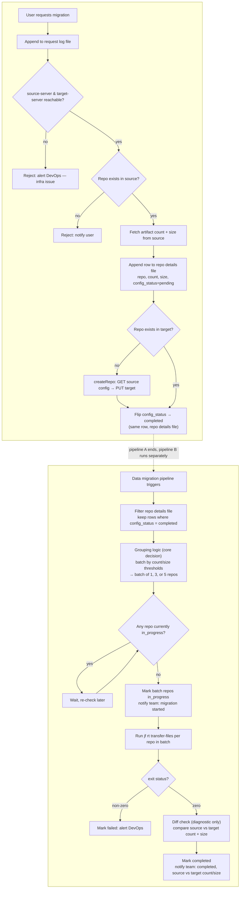

# JFrog migration self-service tool

Self-service tool to migrate Artifactory repositories from a source
instance to a target instance using JFrog Data Transfer
(`jf rt transfer-files`), implemented as shell scripts run by GitHub
Actions. Queueing is native GitHub Actions concurrency control; state is
tracked in JSON files committed back into this repo.

## Status

Design / early implementation. The scripts currently implement a single
pipeline (connectivity check → repo check/create → transfer). The
two-pipeline, batched design below is the agreed direction — see
`docs/design.md` for open decisions (batch thresholds, what triggers
Pipeline B) and rationale.

## High-level flow

**Pipeline A — pre-migration (runs per request)**

1. **One-time, manual:** Data Transfer plugin installed on the source VM
   (not checked or managed by this tool).
2. User requests a migration; the request is appended to a request log
   file.
3. Connectivity check: `jf rt ping` against `source-server` and
   `target-server`. If either is unreachable, reject and **alert
   DevOps** (infra issue, not something the requesting user can fix).
4. If the repo doesn't exist in source at all, reject and notify the
   user (this one's user-actionable).
5. Fetch artifact count + size from source, and append a row to a repo
   details file: `repo, count, size, config_status=pending`.
6. Config-only transfer: if the repo doesn't exist in target, create it
   from source's config (`GET` source → `PUT` target). No data is moved
   in this step.
7. Flip `config_status` to `completed` in that same row — no separate
   tracking file.

**Pipeline B — data migration (batch, separate trigger)**

8. Filter the repo details file down to rows where `config_status =
   completed`.
9. Grouping logic (still being tuned): batch those repos by count/size
   thresholds into a batch of 1, 3, or 5.
10. Check whether any repo is currently `in_progress`; if so, wait and
    re-check rather than starting a second transfer concurrently.
11. Mark the batch's repos `in_progress` and notify the team the
    migration has started.
12. Run `jf rt transfer-files` per repo in the batch.
13. On exit:
    - Non-zero → mark `failed`, **alert DevOps**.
    - Zero → run a diagnostic-only file count/size comparison between
      source and target (logged, never blocks completion), mark
      `completed`, and notify the team with the source-vs-target
      count/size.

## Repo layout

```
.github/workflows/migrate.yml   workflow_dispatch trigger, orchestrates the steps below
.github/workflows/lint.yml      shellcheck on every script change
scripts/repo_manager.sh         connectivity check, repo existence checks, config-only repo creation
scripts/migrate.sh              preMigration wait check, runs transfer-files, polls progress, logs diff_notes
scripts/state.sh                init/update/read state/<job_id>.json, commits + pushes
scripts/lib/common.sh           logging, env config loader, shared by all scripts
config/environments.yaml        source/target server ids, URLs, thresholds (no secrets)
state/                          committed per-job state files
docs/                           design notes, decisions, open questions
```

> **Not yet implemented in the scripts:** the request log file, the
> `config_status` column and batching in the repo details file, the
> grouping logic, and the start/completion team notifications. Currently
> `repo_manager.sh` and `migrate.sh` run the single-pipeline version
> (connectivity → repo check/create → transfer, one repo per run). This
> README documents the two-pipeline design we're building toward — see
> `docs/design.md` for what's tracked as open.

## Flow diagram



## Requirements

- A self-hosted GitHub Actions runner (the migration VM itself) with
  `jf c add source-server ...` and `jf c add target-server ...` already
  configured manually — no tokens or `jf` server setup happens inside
  the workflow
- GitHub Actions with `contents: write` permission on this repo (needed
  to commit the request log / repo details files back)
- `jf` CLI, `jq` on the runner (already required for the manual `jf c
  add` step above)

## Running a migration

1. One-time, manual: install the Data Transfer plugin on the source VM,
   and run `jf c add source-server ...` / `jf c add target-server ...`
   on the migration VM (self-hosted runner).
2. Trigger Pipeline A (currently `workflow_dispatch`, issue-based
   trigger planned) with the repo name.
3. Pipeline B picks it up on its own trigger once `config_status` is
   `completed` — see docs/design.md for what still decides that trigger.

## Known limitations (see docs/design.md for detail)

- Plugin installation on the source VM is manual and not verified by
  this tool.
- Completion is determined by `jf rt transfer-files` exit status;
  file count/size differences are logged but do not block completion.
- Grouping/batch-size thresholds (1, 3, or 5 repos per batch) aren't
  decided yet.
- What triggers Pipeline B (schedule vs. Pipeline A kicking it off
  directly) isn't decided yet.
- Team notifications (start/completion) aren't wired to any channel
  yet — needs a Slack webhook, email, or similar picked.
- The progress-parsing regex in `migrate.sh` assumes a particular
  `jf rt transfer-files` output shape — verify it against your installed
  CLI version and adjust if the JSON progress line format differs.