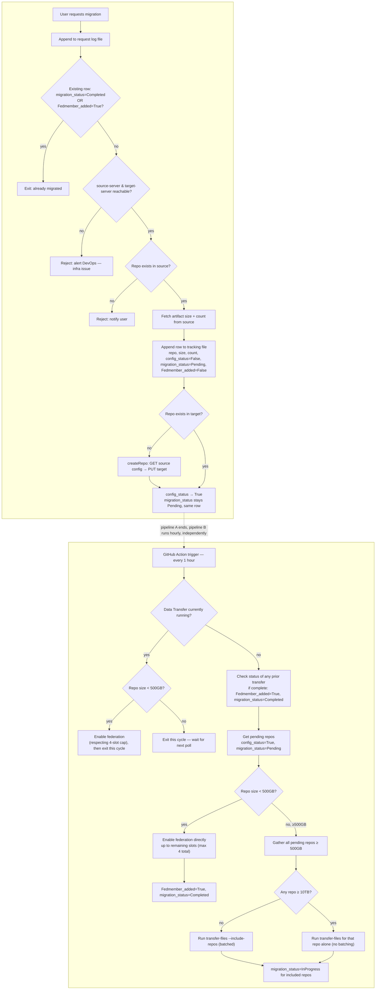

# JFrog migration self-service tool

Self-service tool to migrate Artifactory repositories from a source
instance to a target instance, using either JFrog Federation (small
repos) or Data Transfer (`jf rt transfer-files`, large repos),
implemented as shell scripts run by GitHub Actions. A per-request
pipeline logs and prepares each repo; an hourly scheduler picks up
prepared repos and runs the appropriate migration mechanism. State is
tracked in a single file committed back into this repo.

## Status

Design / early implementation. The scripts currently implement the
older single-pipeline version (connectivity check → repo check/create →
transfer). The Federation + Data Transfer design below is the agreed
direction — see `docs/design.md` for open decisions (size thresholds,
federation-cap counting, failure handling) and rationale.

## High-level flow

**Pipeline A — pre-migration (runs per request)**

1. **One-time, manual:** Data Transfer plugin installed on the source VM
   (not checked or managed by this tool).
2. User requests a migration; the request is appended to a request log
   file.
3. **Early exit:** if a tracking row already exists for this repo with
   `migration_status = Completed` OR `Fedmember_added = True`, exit
   immediately — no connectivity check, no repo lookups. Already done.
4. Connectivity check: `jf rt ping` against `source-server` and
   `target-server`. If either is unreachable, reject and **alert
   DevOps** (infra issue, not something the requesting user can fix).
5. If the repo doesn't exist in source at all, reject and notify the
   user (this one's user-actionable).
6. Fetch artifact size + count from source, and append a row to a
   single tracking file: `repo, size, count, config_status=False,
   migration_status=Pending, Fedmember_added=False`.
7. Config-only transfer: if the repo doesn't exist in target, create it
   from source's config (`GET` source → `PUT` target). No data is moved
   in this step.
8. Flip `config_status` to `True` in that same row. `migration_status`
   and `Fedmember_added` stay untouched — Pipeline A never sets either
   of them again.

**Pipeline B — federation + data transfer scheduler (hourly)**

Two migration mechanisms, chosen by repo size: **Federation** (near
instant, capped at 4 concurrently enabled repos) for repos under 500GB,
and **Data Transfer** for repos at or above 500GB. A repo moved via Data
Transfer is added as a federation member once its transfer completes.

9. Runs on an hourly schedule (not triggered by Pipeline A). First
   check: **is a Data Transfer job currently running?**
10. **If running:** a pending repo under 500GB still gets federation
    enabled (respecting the 4-slot cap), then the cycle exits — no new
    Data Transfer is started while one is already in flight.
11. **If not running:** first check the status of any previously
    started transfer; if it completed, add that repo as a federation
    member (`Fedmember_added = True`, `migration_status = Completed`).
    Then look at pending repos (`config_status = True, migration_status
    = Pending`):
    - Under 500GB → enable federation directly (up to the remaining
      slots, max 4 total) → `Fedmember_added = True, migration_status =
      Completed`.
    - 500GB or more → gather all pending repos in that size class and
      run `jf rt transfer-files --include-repos` as one batched job —
      **except** if any repo is 10TB or larger, in which case it runs
      alone, unbatched. Rows included are set to `migration_status =
      InProgress`.

## Repo layout

```
.github/workflows/migrate.yml   workflow_dispatch trigger, orchestrates the steps below
.github/workflows/lint.yml      shellcheck on every script change
scripts/repo_manager.sh         connectivity check, repo existence checks, config-only repo creation
scripts/migrate.sh              preMigration wait check, runs transfer-files, polls progress, logs diff_notes
scripts/state.sh                init/update/read state/<job_id>.json, commits + pushes
scripts/lib/common.sh           logging, env config loader, shared by all scripts
config/environments.yaml        source/target server ids, URLs, thresholds (no secrets)
state/                          committed per-job state files
docs/                           design notes, decisions, open questions
```

> **Not yet implemented in the scripts:** the request log file, the
> six-column tracking file (`config_status`, `migration_status`,
> `Fedmember_added`), the early-exit check, the Federation-enable path,
> the hourly scheduler and its running/not-running branching, the
> `--include-repos` batching, and the start/completion team
> notifications. Currently `repo_manager.sh` and `migrate.sh` run the
> older single-pipeline version (connectivity → repo check/create →
> transfer, one repo per run, no Federation). This README documents the
> design we're building toward — see `docs/design.md` for what's tracked
> as open (the 500GB/10TB thresholds, whether a Data-Transfer-completed
> repo counts toward the 4-slot federation cap, and failure/retry
> handling for the scheduler, which isn't defined yet).

## Flow diagram



## Requirements

- A self-hosted GitHub Actions runner (the migration VM itself) with
  `jf c add source-server ...` and `jf c add target-server ...` already
  configured manually — no tokens or `jf` server setup happens inside
  the workflow
- GitHub Actions with `contents: write` permission on this repo (needed
  to commit the tracking file / request log back)
- `jf` CLI, `jq` on the runner (already required for the manual `jf c
  add` step above)

## Running a migration

1. One-time, manual: install the Data Transfer plugin on the source VM,
   and run `jf c add source-server ...` / `jf c add target-server ...`
   on the migration VM (self-hosted runner).
2. Trigger Pipeline A (currently `workflow_dispatch`, issue-based
   trigger planned) with the repo name.
3. Pipeline B's hourly run picks it up automatically once `config_status
   = True` — small repos get Federation enabled directly; large repos
   go through Data Transfer and get added to Federation once that
   completes.

## Known limitations (see docs/design.md for detail)

- Plugin installation on the source VM is manual and not verified by
  this tool.
- The 500GB (Federation vs. Data Transfer) and 10TB (batched vs. solo
  transfer) thresholds are placeholders — not validated against real
  transfer times or Federation's actual limits.
- Whether a repo added to Federation *after* a Data Transfer job counts
  toward the 4-slot Federation cap isn't decided — if it does, the "get
  pending repos" step needs to recount before deciding how many slots
  are actually free.
- Failure handling for `jf rt transfer-files` in the scheduler isn't
  defined yet — no retry, no alerting path, no terminal `failed` state.
  A repo whose transfer fails will just sit at `migration_status =
  InProgress` forever with nothing to notice or fix it.
- Team notifications (start/completion) aren't wired to any channel
  yet — needs a Slack webhook, email, or similar picked.
- The progress-parsing approach for a running transfer (if any) isn't
  defined for this scheduler design — the older `migrate.sh` used a
  regex against `jf rt transfer-files` stdout, which may not carry over
  cleanly to batched `--include-repos` runs.